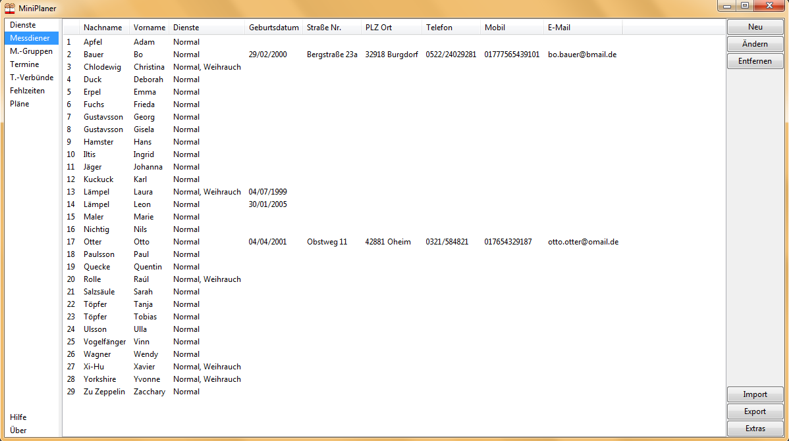
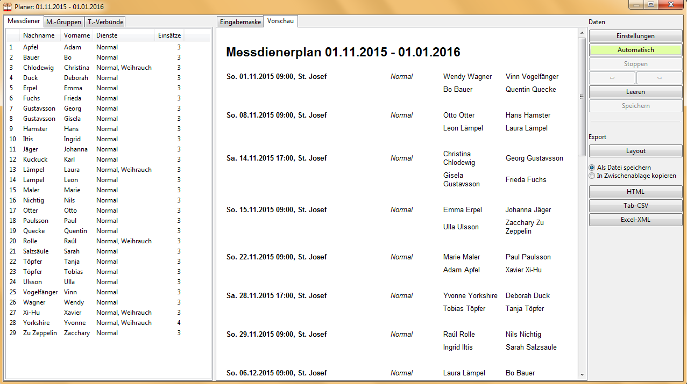

# MiniPlaner

Software zum effizienten Erstellen hochwertiger Messdienerpläne.

## Beschreibung

Das Programm **MiniPlaner** ist ein Werkzeug zur Erstellung von Messdienerplänen in Kirchengemeinden und Pfarrverbünden. Es ist sehr übersichtlich gehalten, bietet jedoch vielfältige Einstellungsmöglichkeiten: Messdiener und Termine können auf verschiedene Weisen gruppiert werden, das flexible Dienst-System lässt individuelle Maßlösungen zu und Messdiener können für Zeiträume oder bestimmte Gottesdienste als fehlend eingetragen werden. So kann etwa festgelegt werden, dass zu einem Gottesdienst mindestens ein älterer Messdiener oder jemand, der Weihrauch beherrscht, mit dabei ist, dass Geschwister meist/immer zusammen dienen oder dass niemand sowohl in der Vorabendmesse am Samstag als auch zum Hochamt am Sonntag dienen muss. Man kann viel eingeben, muss aber nicht.

 

Nach der Eingabe aller benötigten Daten können schnell Pläne für vorzugebende Zeiträume erstellt werden, interaktiv oder automatisch mittels eines Algorithmus, welcher verschiedene einen gelungenen Plan ausmachenden Faktoren gleichzeitig zu berücksichtigen versucht. Das Programm bietet hierbei verschiedene Kontrollmöglichkeiten und Eingabehilfen an. Der Export der graphisch aufbereiteten fertigen Pläne ist in verschiedenen Formaten möglich - als [Webseite](Ministrantenplan_bsp.html) oder als [PDF-Datei](Ministrantenplan_bsp.pdf) zum Ausdrucken.

Ist bereits eine Liste aller Messdiener in einem Tabellenformat vorhanden, so kann der Import dieser als CSV-Datei die Dateneingabe enorm beschleunigen, ebenso das Verwenden von Serienterminen für periodische Termine.

Ausführliche Informationen zu Bedienung und Funktionsweise finden sich im [Handbuch](Handbuch.pdf)

## Daten

* Version: 2.0.3
* Größe: 7.2 MB
* System-Voraussetzungen: Windows ab XP (32/64 bit), Linux und Mac auf Nachfrage
* Autor: Yannik Schälte

## Download

Die Verwendung des Programms ist kostenlos möglich. Rückmeldungen und Kritik sind sehr willkommen, um das Programm weiter verbessern zu können. Suchen Sie sich einfach eine der folgenden gleichwertigen Installationsvarianten aus:

* [MiniPlaner.zip](MiniPlaner.zip) (heruntergeladene Datei per Rechtsklick + "Alle Extrahieren" entpacken
* [MiniPlaner.7z](MiniPlaner.7z) (mit dem Kompressionsprogramm 7-Zip entpacken
* [MiniPlaner_Setup.exe](MiniPlaner_Setup.exe) (Installer starten und Anweisungen folgen)

Im entpackten Verzeichnis ``MiniPlaner/`` befindet sich die ausführbare Datei ``MiniPlaner.exe``, dies ist das zu startende Hauptprogramm. Auch eine Deinstallation ist denkbar einfach: Löschen Sie einfach das Verzeichnis ``MiniPlaner/``, da das Programm lediglich hier Daten speichert.

## Beispiel

Folgende Varianten sind bereits mit Beispieldaten gefüllt und können temporär neben der eigentlichen Installation verwendet werden (eine Installation verwaltet stets nur einen Datensatz):

* [MiniPlaner_Beispiel.zip](MiniPlaner_Beispiel.zip)
* [MiniPlaner_Beispiel.7z](MiniPlaner_Beispiel.7z)

## Add-Ons

* **MiniInterface**: Deponieren Sie die Datei [MiniInterface.php](MiniInterface.php) auf Ihrer Gemeinde-Homepage, so können Messdiener über ihren Browser zuhause selbst eintragen, wann sie dienen möchten. Diese Daten können Sie dann im **MiniPlaner** bei der Planerstellung automatisch berücksichtigen lassen.

## Updates

Wenn Sie eine ältere Version (&le; 2.0.2) des Programms bereits installiert haben, ersetzen Sie im Verzeichnis ``MiniPlaner/`` die Datei ``MiniPlaner.exe`` einfach durch [diese](MiniPlaner.exe) neue Version.

* 12.10.2016 (2.0.3): several minor error fixes, added "Termin::extras" button and "Mini::bem" attribute, added fill-in-help
* 30.04.2016 (2.0.2): integrated MiniInterface, certain changes of mass data in plan window possible
* 18.02.2016 (2.001): 2 minor error fixes, added "Mini::extras" button
* 11.10.2015 (2.0): initial release

## Hilfe und Kontakt

* [Handbuch](Handbuch.pdf)
* E-Mail: ``yannik.schaelte <at> gmail.com``

&copy; 2018 Yannik Schälte. Alle Rechte vorbehalten.
